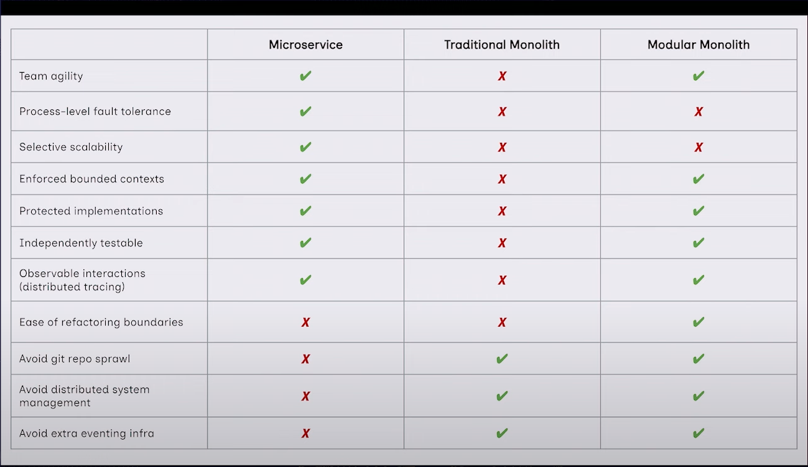

# Spring Modulith Implementation

<!-- TOC -->
* [Spring Modulith Implementation](#spring-modulith-implementation)
    * [Data Setup](#data-setup)
    * [Learnings](#learnings)
    * [How Spring Modulith Behaves when there are multiple instance of same application deployed (Without `@Externalized` )](#how-spring-modulith-behaves-when-there-are-multiple-instance-of-same-application-deployed-without-externalized-)
    * [After Using `@Externalized` annotation](#after-using-externalized-annotation)
    * [How Spring Modulith Behaves when we have  `@Externalized` event to kafka and also has one event listener in Application](#how-spring-modulith-behaves-when-we-have-externalized-event-to-kafka-and-also-has-one-event-listener-in-application)
    * [Postman Collection for API's present in Project](#postman-collection-for-apis-present-in-project)
    * [Useful Commands](#useful-commands)
  * [Reference](#reference-)
    * [Comparison between Microservice ,Traditional Monolith and Modular Monolith](#comparison-between-microservice-traditional-monolith-and-modular-monolith-)
<!-- TOC -->

### Data Setup

-------
1. Navigate to `datasetup` directory.
2. Run `./setupData.sh` file.
3. After successful execution of step-2 it adds sample data.
-------

### Learnings

-------
1. For each listener annotated with  `@ApplicationModuleListener`/`@TransactionalEventListener` it created one entry in `event_publication` table
2. When we use simple `@EventListener` it doesn't create entry in `event_publication` table. it publishes event synchronously. 
3. When we remove `@Transactional` from the method which is publishing the event then event is stored in `event_publication` table but not consumed by listener methods annotated with  `@ApplicationModuleListener`/`@TransactionalEventListener`/`@EventListener`.

-------
### How Spring Modulith Behaves when there are multiple instance of same application deployed (Without `@Externalized` )

-------

1. When `instance 1` and `instance 2` of applications are deployed together
2. The event published by `instance 1` will be consumed by consumer in same `instance 1`
3. If `instance 1` publishes the event, and before it is consumed by consumer 
   if `instance 1` terminated then event won't be consumed by `instance 2`'s consumer.
4. If `instance 1` publishes the event, and before it is consumed by consumer
   if `instance 1` terminated then the new instance `instance 3` that will be spin up can republish the outstanding messages 
   if `spring.modulith.republish-outstanding-events-on-restart=true` property is enabled .
5. In order to handle republishing of outstanding events on demand we can use `IncompleteEventPublications` to resubmit outstanding events.
-------

### After Using `@Externalized` annotation

-------
- With `@Externalized` annotation we can publish messages to various targets as given in spring modulith documentation.
- When `@Externalized` annotation is used and Modulith starts publishing events to Kafka.
  In order to see the published message on  topic `FoodOrderPlaced` 
  mention as `target` in `@Externalized(target = "FoodOrderPlaced")` event record.
  We can used below kafka console consumer command to consume kafka messages
   `kafka-console-consumer --bootstrap-server localhost:29092 --topic FoodOrderPlaced --from-beginning`
-------

### How Spring Modulith Behaves when we have  `@Externalized` event to kafka and also has one event listener in Application

-------
- It creates one event of type `org.springframework.modulith.events.support.DelegatingEventExternalizer.externalize(java.lang.Object)` for kafka and
another event for event listener in Application in `event_publication` table

-------

### Postman Collection for API's present in Project

-------
1. Navigate to `Postman collection` directory.
2. Import `FoodDelivery.postman_collection.json` file in postman.
-------

### Useful Commands

-------
- To make container service up  `podman-compose up -d`
- To make container service down  `podman-compose down`

-------
## Reference 

-------

### Comparison between Microservice ,Traditional Monolith and Modular Monolith   

-------

-------